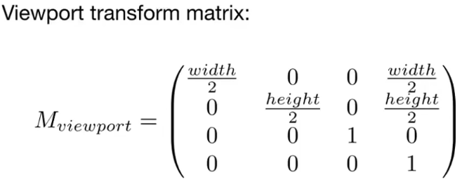
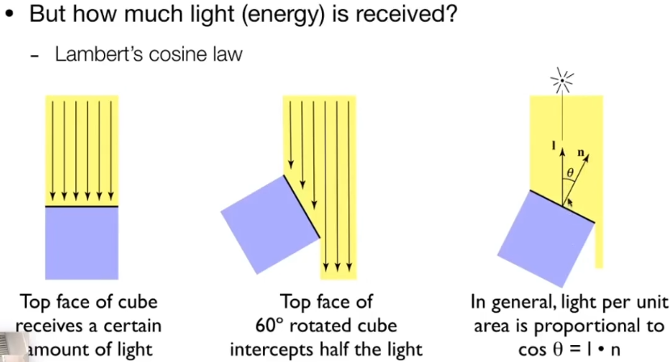
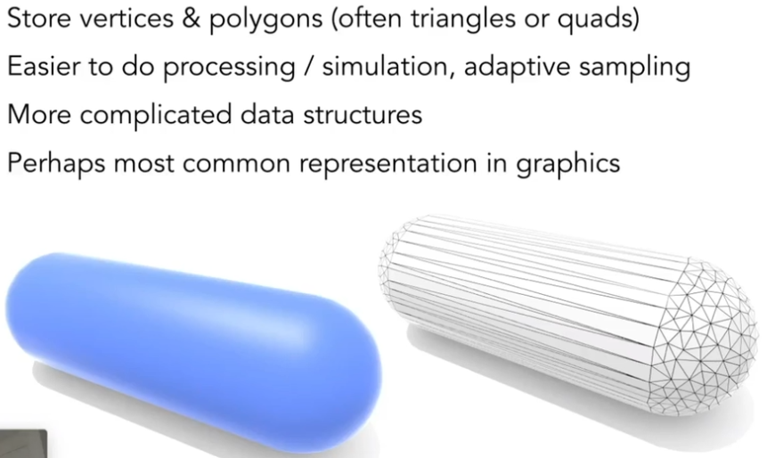
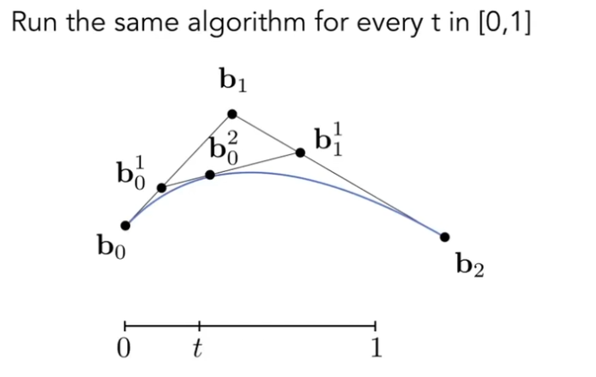
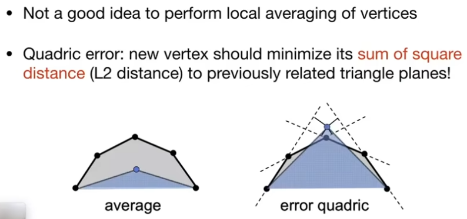
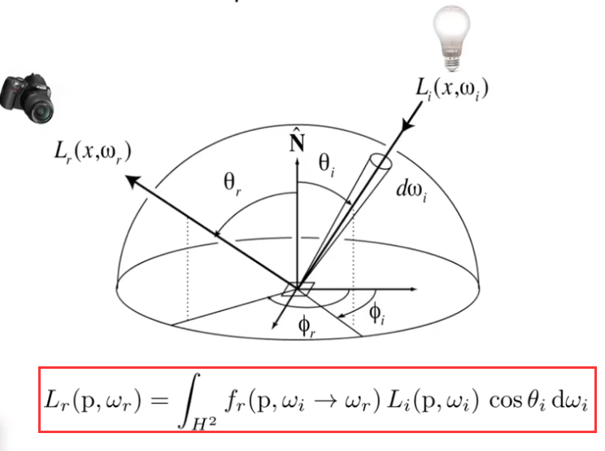
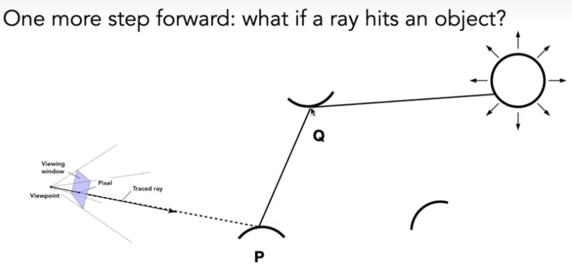
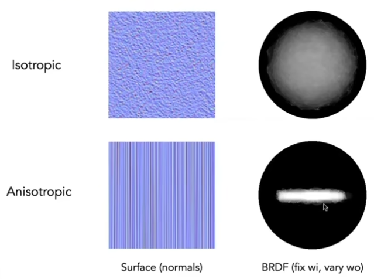
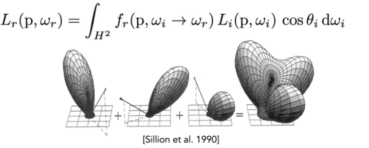
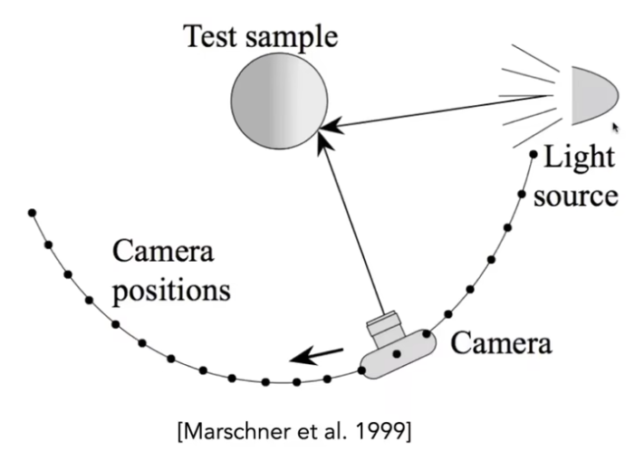

# GAMES101 note

* 计算机视觉与计算机图形学的区别与联系：

## Linear Algebra

### Vectors

* Direction and length

* Unit vector

  * 

  #### Dot product **(give a number)**

  * basic 
    * 
  * Properties
    * 
    * 
    * for projection(投影)
      * 
    * application
      * 

  #### Cross Product **(give a vector)**

  * basic
    * 
  * Properties
    * 
    * in Linear Algebra
      * 
    * application
      * determine left or right for the vector 
      * **可以判断一个点在不在一个三角形内**（在做光栅化时要判断一个三角形覆盖了那些像素，这时候需要用到这个基本的算法）

### Matrices 

* Multiplication
  * 
* 对向量做变换操作（向量乘以一个变换矩阵）
* Properties
  * 
  * 单位矩阵 （定义矩阵的逆矩阵）
    * 
  * 向量的点乘和叉乘都可以转换为矩阵的乘法
    * 

### Transform

（根据坐标点的变化写出变换矩阵）（这里列出二维的变换，三维的变换矩阵可以进行类比）

#### 2D 线性变换：

* 缩放变换
  * 
* 镜像变换
  * 
* 切边
  * 
* 旋转变换
  * 
  * 
* 平移变换
  * **需要强调的是，平移变换不是线性变换，但是我们希望利用一个矩阵形式就包含掉所有的变换，而不让平移变换成为特例，所以之后人们引入的齐次坐标来进行统一**

* **引入齐次坐标 来统一所有变换的矩阵乘法变换** （先进行线性变换再平移）
  * 
  * 引入一个新的维度的意义：
    * 
    * 使用齐次坐标，二维情况下的变换矩阵
      * 

#### 3D Transform

三维空间中利用齐次坐标写出的变换矩阵

* 
* 旋转
  * （罗德里格斯旋转公式）任意旋转的变换矩阵
  * 四元数的引入：因为旋转矩阵不太好做差值（比如，一个旋转15°的旋转矩阵与一个旋转25°的旋转矩阵做平均，得不到我们想要的旋转20°的旋转矩阵），所以引入四元数

**MVP：（Model，View，Projection）**

##### 视图变换（View）

* 规定相机在一个标准位置上（以相机为中心，不管最开始相机于模型的位置怎么摆，先把相机通过变换移动到规定的位置（position在原点，朝向-Z轴看，向上的位置为Y轴），模型随之变换）
* **正交矩阵的逆矩阵与他的转置矩阵相同**，在解一个旋转矩阵遇到困难时，可以考虑他的逆矩阵，先写出逆矩阵，在求这个旋转矩阵

##### 投影变换（Projection）

* 正交投影（没有近大远小的视觉效果）
  * 
  * 
    * **对应的变换矩阵：**
* 透视投影（有近大远小的效果）
  * 
  * 如何做透视投影：分两步
    * 
    * “挤压变换矩阵”：

## Rasterization(光栅化)

### 定义：

​	**将三维空间的几何形体显示在二维的屏幕上**

​	在计算机图形学中：

​	**屏幕**：一个二维的数组（一个元素为一个像素）

​	**屏幕空间**：建立一个XY坐标系，以像素的左下角坐标描述像素的位置，但	需要注意的是，像素的中心点不是整数

​	**视口变换**：

​	**光栅化过程**：把之前经过MVP过程的一个立方体再经过视口变换得到多变形的输入，之后再将其把“画”到屏幕上（用像素来呈现）

### 将多边形画到屏幕上的方法：

#### 1.采样

​	**采样是在重复原始信号的频谱**（以此来解释走样）

​	检测**每个可能的像素**（利用像素中心来代表一个像素的位置来进行判断短）（Bounding Box 限制范围）**是不是在三角形内**（利用像素的中心点与三角形的各个顶点构成的向量做叉积来判断），如果在，那就给像素画上颜色

​	**走样：**信号变化太快，采样速度跟不上信号变化的速度导致走样；另外一种说法即，我们用同一种采样方式采样多个函数，但是他们采样的结果是一样的，我们无法区分（如下图所示，用相同的采样方法去采样两个函数，得到的结果是一样的，无法区分）；从可以从频谱角度说明

​	

​	**傅里叶变换：**

​	**卷积**：在空间域上做卷积，相当于将空间域转换到频域后相乘

#### 2.反走样

* 先对信号做滤波（去掉一些特定的频率，如模糊，高通滤波（只剩下高频信息）），再进行采样来达到反走样（抗锯齿）的效果
* 
* MSAA method
  * 增加采样点得到近似的三角形覆盖率，从而更好地上色来减少锯齿
  * 代价是增加了采样点，而导致计算开销变大
  * 还有另外的方法，如 FX（Fast Approximate）AA, T（Temporal）AA
* 超分辨率方法
  * 把小图拉大，但不损失分辨率（DLSS：Deep Learning Super Sampling）

#### 3.三角形的遮挡和可见性处理（Z-buffering）

* 1.画家算法
  * 从远到近，一层一层覆盖，得到最后正确的结果
  * 计算开销较大
  * 不是普适适用的
    * 
* Z-buffer（深度缓存）算法
  * 对**每个像素**（或对每个采样点）来排深度信息
  * 
  * 算法（与画的顺序没有关系，复杂度为O（n））：
    * 
    * 一个例子：
      * 
  * 处理不了透明物体

## Shading（着色）

 #### 1.Blinn-Phong 着色模型（光线与材质作用）

**一共有三个不同的效果项构成了完整的视觉效果：漫反射、高光、间接光**

* **漫反射项**

  * 
  * 

  

  

  

* **高光项**

  * 观察方向与镜面反射方向接近时会看到高光
  * 
  * 指数P的作用：减少“容忍度”，只有**在小夹角才能看到高光**
    * 

* **环境光项（间接光照）**

  * 环境光比较复杂，需要做一些近似假设
    * 

#### 2.着色频率（shading frequencies）

**有三种着色的方式：逐三角形、逐顶点（vertex）、逐像素（Phong shading）**

**这三种着色方式在不同情况下（模型的面数多少），各有优劣（画面质量与计算开销的考量）：**

* **逐三角形着色**：
* **逐顶点着色**：着色时先对三角形的三个顶点做着色，而**三角形内部的点根据顶点的着色值来做平滑差值**
  * 定义**顶点的法线方向**：
  * **如何在三角形内部进行平滑差值（基于重心坐标）**：
    * **重心坐标：(利用三角形的三个顶点去描述三角形内部的一个顶点的方式)**
      * 
    * 求三角形内任何一个点重心坐标的方法：
      * 三角形本身的重心坐标很特殊，它的重心坐标就是（⅓，⅓，⅓）
      * 
      * 另一种计算方式：
      * **三角形内部某一点差值的属性与三角形三个顶点的关系**和**该点重心坐标与三个顶点满足的线性关系相同**，根据这个性质，就可以通过重心坐标来对三角形内部的任意一个点做相关属性（颜色等等）的差值
        * 重心坐标的差值有一个问题：**不能保证投影不变性**
    * 
* **逐像素着色**：
  * 
  * 定义像素的法线方向：

#### 3.渲染管线

* 
* **Shader（着色器）**：
  * 分为vertex shader 和 fragment shader
  * 每一个顶点或像素都会执行一次
  * 

#### 4.纹理映射（Texture Mapping）

* 
* 
* **纹理映射的具体做法：**
  * 三角形内部顶点的uv坐标就根据重心坐标来求得，然后根据uv坐标去相关颜色，把它赋值给bulin-phong模型中的kd即可
  * 纹理映射会遇到的问题：
    * 纹理太小时（高分辨率屏幕上应用低分辨率的纹理贴图），会遇到类似锯齿（最终呈现在屏幕上的分辨率很低）的低质量图片，造成这个问题的**原因是当我们在查询像素的uv坐标时，会得到非整数的坐标，这导致很多个屏幕像素对应相同的一个纹理像素**
      * 解决方法：***双线性差值***，即**我们想得到一个更精确（更平滑）非整数uv映射的像素的颜色，我们同时考虑映射后的uv坐标邻近的四个纹理像素，来进行差值得到最终的纹理像素的值**
        * 
        * 
    * 纹理太大时，会导致严重的走样问题，产生的原因：每个像素点覆盖的纹理像素的范围是不同的，原本的采样方法就不适用了；**利用信号变化频率和采样频率来理解就是，当纹理贴图太大时，我们要把纹理贴图缩放到与像素屏幕一样的大小，这就导致了一个像素覆盖了很多的纹理像素（即一个像素的信号变化频率很大），如果我们的采样方法不变（采样频率小于信号变化频率就会导致走样），就会导致走样**（ps：需要注意的是，远处物体的一个像素会覆盖更多的纹理像素），根据这一理论可以提出如下的解决方法：（**范围查询**）
      *  超采样：即增加采样的点（使采样频率大于信号变化频率来解决走样问题），他的代价是计算开销太大
      * mipmap（图像金字塔）：只能做近似的正方形的范围查询
        * 做了什么操作：**对原始图像进行降低分辨率的操作，每次减少一半（比如，128×128 减少到64×64），一直减少到只剩一个像素，把每次减少分辨率的图像存起来（只增加了原始图三分之一的存储）**
        * 当有了mipmap存储的图后，就可以根据像素在纹理贴图中覆盖的近似正方形范围去查询mipmap中的某层图片来作为该像素的平均纹理像素
          * 
        * 利用三线性差值来平滑结果（得到连续的表达）
          * 
        * 这种方法也有一些**缺点**，比如远处的物体会过分模糊，细节缺失，这是因为mipmap**只能做正方形近似**导致的结果
          * **解决方法**：
            * 各向异性过滤：对于矩形的覆盖得到了一定的解决，但是并没有完全解决
            * EWA过滤：把不规则的形状长城不同的圆形来拟合这个形状，缺点是开销比较大
  * **纹理的应用**
    * 环境贴图：模拟材质反射环境光照，描述来自不同方向的光照信息
      * 假设：环境光来自于无限远处
      * CubeMap技术，降低纹理贴图的扭曲程度
    * 凹凸贴图：存储高度、法线方向
      * 以更小的开销，获得更细致的视觉效果（仿真复杂的几何细节）
      * 
      * 计算：**在二维中：**
        * 三维可以类比：
    * 位移贴图
      * 真正改变几何的位置
      * 需要网格有较高的细致程度

#### 5.阴影（Shadows）

* 利用 **Shadow mapping** 技术生成 Shadow map 在光栅化中做阴影效果
  * 像素能否被**光源**看到、像素能否被**摄像机**看到
  * 1.从光源看向场景，记录每一个能看到的像素的深度；2.从摄像机看向场景，将摄像机看到的点距光源的深度与第一步记录的深度作对比，如果一致，那么该点可见（没有阴影），如果不一致，那么该点就是阴影         
  * 只能做硬阴影

## 几何

### 几何的表述

* 隐式几何
  * 表示几何上的点满足的关系（函数）
  * 缺点：很难从这个表达式直接看出来几何的形状
  * 优点：很容易判断一个点与几何的位置关系
  * 
  * CSG：通过基本几何体的运算（交、并、差）来获得其他复杂的几何
  * 距离函数：（融合）
* 显式几何
  * 参数映射
    * 
    * 优缺点与隐式相反
  * 点云表示
    * 
  * 多边型面
    * 
* 分形几何
  * 不断重复自己（信号变化频率非常高，容易渲染走样）

### 曲线

* 贝塞尔曲线
  * 用一系列的控制点去控制的曲线
  * 贝塞尔曲线符合仿射变换不变性（对控制点仿射变换后重新画一次）
  * 贝塞尔曲线不符合投影变换不变性
  * **算法（de casdejue）：**                                   
    * **任意阶数的贝塞尔曲线（伯恩斯坦多项式）：**
  * 逐段定义的贝塞尔曲线
    * **四个点定义一段贝塞尔曲线，然后把每段曲线连接起来**
    * 
* 贝塞尔曲面（布料模拟？）

 ### 曲面（几何处理）

* 网格细分

  **引入更多的三角形，并调整其位置**

  * **Loop Subdivision**

    

    * 如何更新引入三角形后，各个顶点的位置：
      * 对新的顶点
      * 对旧的顶点

  * **Catmull-Clark Subdivision** 

    **对于一般的情况，不论是三角形还是四边形都可以用**

    * 一些定义：
    * 具体做法：做第一次细分，增加了个数与非四边形面个数一致的这么多奇异点 
    * 
      * FYI（更新顶点的算法）

* 网格简化

  **网格简化的目标是在保持模型大体形状的前提下减少面数，减少面数后，减少渲染开销**（几何的层次结构是一个研究方向）

  * 具体做法：
    * 边坍缩：二次误差测量去决策那些边坍缩
    * 

* 网格规则化

## 光线追踪

**先对光线进行假设：**

* 光沿直线传播
* 光线与光线之间不存在相互作用
* 光线从光源到人眼

### Whitted-Style Ray Tracing

**判断光源与人眼射线弹射点的可见关系后，叠加可见弹射点的光线到像素上**

* 数学表达：

  定义一条光线上的点

  * 光线与**隐式**表面求交点（**可以利用数值计算去近似**）

    * 

  * 光线与**显示**表面（三角形）求交点

    * 光线与三角形有一个交点——> 点在三角形内 ；有两个交点在三角形外（**传统算法无法处理大场景，开销太大**）

      * 
      * MT算法
      * 

    * **优化算法：Bounding Volumes**

      * 利用一个**简单的“包围盒”**将一个**复杂的物体**包围起来，来**替代**原来的复杂物体做光线的计算

      * **从二维拓展到三维**

        

        

      * 怎么利用包围盒来加速光线与物体的求交点运算

        * 空间划分：
          * KD-Tree（存在的问题：叶子结点可能同时存相同的物体；判断包围盒与空间划分出的立方体的交集在算法上较困难）
            * 
            * 光线只与叶子节点求交，不与中间结点求交
        * 物体划分：
          * BVH：

### 辐射度量学

**更为精确（服从物理）的描述光线与光的行为**

#### 前置定义：

* **Radiant Energy and Flux**：
* **Radiant intensity**：
  * **立体角**：
* **Irradiance**：
  * 
* **Radiance**：
  * 
* **Irradiance与Radiance的关系**：

#### BRDF：

**Bidirectional Reflectance Distribution Function（双向反射分布函数）**：

* **BRDF定义**：BRDF告诉我们**单位面积接收到某一立体角的能量会如何分配到各个不同的出射立体角上去（本质上是一个分布函数，类似权重（入射光分配了多少能量到所考察的出射方向上））**

* **反射方程**：任何一个着色点，考虑所有方向的入射光对出射方向上的贡献（积分）

  * 反射方程存在的问题：**除了光源外，其他被光源照亮的物体也会反射光线，成为“次”光源，对出射方向做出贡献**（也需要考虑），反射方程就有点**递归**求解的意思了

* **渲染方程**：**基于反射方程**，再考虑物体的**自发光情况**，我们得到**渲染方程**

  * 
  * 
  * 通过简单化表示渲染方程来得到渲染方程的解：
    * **得到全局光照方程**：

* **蒙特卡洛方法**：

  * https://zhuanlan.zhihu.com/p/396653562?utm_campaign=shareopn&utm_medium=social&utm_oi=938846415775129600&utm_psn=1605230717734256640&utm_source=wechat_session
  * 解决什么问题：对**复杂解析式**的函数进行积分
  * 是一种数值方法，无需对解析式进行积分，在积分域内**不断采样**进行计算，再加起来求平均（采样服从的分布函数为P（x）是我们自己选取的）

* Path Tracing

  * 解决之前Whitted-Style Ray Tracing 的一些不基于真实物理规则的假设

  * **利用蒙特卡洛方法计算渲染方程积分得到全局光照算法**：

    * **先进行直接光照计算**：

    * **1.再考虑间接光照，得到全局光照**：

    * **2.考虑到计算爆炸问题，我们只采样1根光线**（N=1）：

      * 得到**路径追踪**算法：

      * **解决采样少的噪声问题**：**多算几条路径对一个像素的贡献**

    * **3.考虑递归算法的停止条件**：

      * 引入俄罗斯轮盘赌方法：
      * **得到路径追踪算法**：

    * 4.我们之前的算法是**以着色点为基准来采样**，这样产生的一个问题就是，采样效果很大程度上受到光源形状的影响（光源大效果好，光源小碰运气），为了优化这个问题，我们之后**以光源为基准来采**样，这样的话，就需要重写渲染方程，**把积分变量从以着色点为基准时的立体角换为以光源为基准的光源面积**，我们只需要知道立体角和光源面积的关系式就可以完成方程的重写：

    * **在经过上述所有优化过后，再次写出路径追踪算法**：

    * **5.再考虑光源的可见性问题**：

    * **综上所述，得到最终的路径追踪算法**

​				

## 材质：

**Meterial == BRDF** ，材质等价于BRDF，**本质上是描述了某种物体对入射光的响应行为**

### 漫反射

* 漫反射的BRDF视为常数，由于能量守恒，**入射光能量等于反射光能量**，求出**漫反射的BRDF表达式**：（其中**albedo为颜色的调制项**）

### 镜面反射

* 根据反射定律，利用不同的方法对入射光、反射光进行计算

### 折射

* 折射定律：
  * 
* 根据折射定律计算折射角的余弦：
  * 
  * 当根号下小于0时，不存在折射，此时发生全反射：当入射光从光疏介质打到光密介质时会反生

### 菲涅尔项

* 描述**反射率**与**物体法线与观察方向（人眼）夹角**之间的关系：**反射率取决于物体法线与观察方向（人眼）夹角，夹角越大，反射的能量越多**
* 

### 微表面材质

* 假设：
  * 远处：视材质表面是平的，有粗糙度
  * 近处：有凹凸，可以看到几何
* **通过用微表面的法线分布来描述材质的粗糙程度**：
  * 
  * **微表面假设下的BRDF**：
* 各向同性（微表面不存在方向性）与各向异性（微表面存在明显的方向性）材质
  * 
  * 各向异性材质：不同角度的BRDF不同：
* BRDF的性质：
  * 非负性
  * 线性叠加性
    * 
  * 可逆性：
    * 
  * 能量守恒
    * 
  * 各向同性与各向异性
    * 各向同性：
* **BRDF的测量**：
  * 

